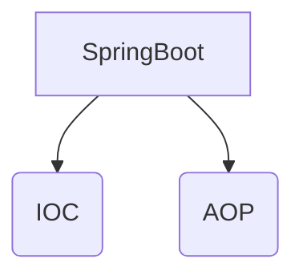
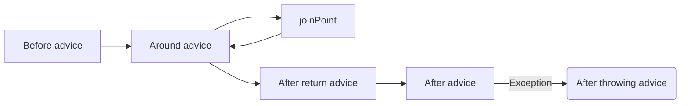
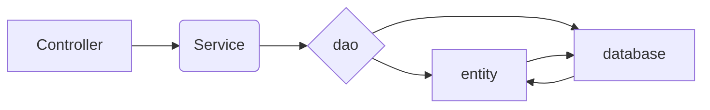

组长的任务罢了

<!--more-->

## 基本概念

> AOP为Aspect Oriented Programming，AOP是OOP的延续
>
> > 利用AOP可以对业务逻辑的各个部分进行隔离，从而使得业务逻辑各部分之间的==**耦合度降低**==，提高程序的可==**重用性**==，同时提高了开发的效率。

- `Pointcut`: 切点，用于定义哪个方法会被拦截，例如` execution(* cn.springcamp.springaop.service.*.*(..))`
- `Aspect`: 切面，把Pointcut和Advice组合在一起形成一个切面
- `Join Point`: 所有可能执行的Pointcut
- `Advice`: 拦截到方法后要执行的动作
  - `before advice`, 在 join point 前被执行的 advice. 虽然 before advice 是在 join point 前被执行, 但是它并不能够阻止 join point 的执行, 除非发生了异常(即我们在 before advice 代码中, 不能人为地决定是否继续执行 join point 中的代码)
  - `after return advice`, 在一个 join point 正常返回后执行的 advice
  - `after throwing advice`, 当一个 join point 抛出异常后执行的 advice
  - `after(final) advice`, 无论一个 join point 是正常退出还是发生了异常, 都会被执行的 advice.
  - `around advice`, 在 join point 前和 joint point 退出后都执行的 advice. 这个是最常用的 advice.
  - `introduction`，introduction可以为原有的对象增加新的属性和方法。
  - 顺序: 

- `Weaver`: 实现AOP的框架，例如 AspectJ 或 Spring AOP

## 应用场景

> 日志记录，性能统计，安全控制，==权限管理==，==事务处理==，==异常处理==，资源池管理

## web层级

## 

## 参考链接
> [Spring AOP是什么？为什么要有Spring AOP？](https://www.zhihu.com/question/344440064)
>
> [SpringBoot项目中使用AOP的方法](https://www.jb51.net/article/135254.htm)
>
>  [SpringBoot切面Aop的demo简单讲解](https://www.cnblogs.com/xuwujing/p/12927081.html)